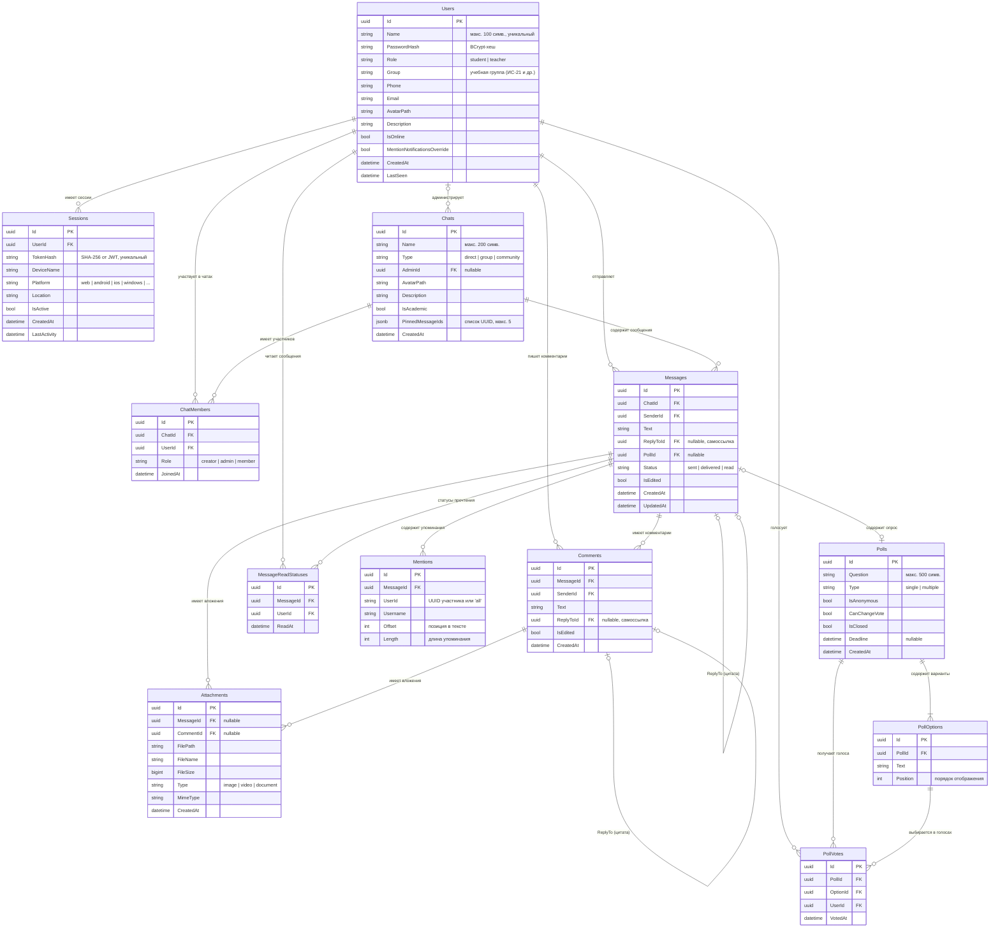

# ER-диаграмма базы данных — Caspian College Messenger

---

## Описание связей

| Связь | Тип | Описание |
|-------|-----|----------|
| Users → Sessions | 1:N | Один пользователь — несколько активных сессий (разные устройства) |
| Users → ChatMembers | 1:N | Пользователь может быть участником многих чатов |
| Chats → ChatMembers | 1:N | Чат содержит список участников с ролями |
| Chats → Messages | 1:N | Все сообщения принадлежат одному чату |
| Messages → Messages | 0..1:N | Самоссылка: ReplyToId — цитата другого сообщения |
| Messages → Polls | 1:0..1 | Сообщение может содержать опрос |
| Messages → Comments | 1:N | Тред комментариев под сообщением |
| Messages → Attachments | 1:N | Вложения сообщения |
| Messages → Mentions | 1:N | Упоминания @user и @all в тексте |
| Messages → MessageReadStatuses | 1:N | Таблица прочтений: кто и когда прочитал |
| Comments → Attachments | 1:N | Вложения комментария |
| Comments → Comments | 0..1:N | Самоссылка: ReplyTo — цитата комментария |
| Polls → PollOptions | 1:2..10 | Минимум 2, максимум 10 вариантов ответа |
| Polls → PollVotes | 1:N | Все голоса по опросу |
| PollOptions → PollVotes | 1:N | Голоса за конкретный вариант |

## Уникальные ограничения (UNIQUE)

| Таблица | Поля | Смысл |
|---------|------|-------|
| `Users` | `Name` | Имя пользователя — уникальный идентификатор |
| `Sessions` | `TokenHash` | Один токен — одна сессия |
| `ChatMembers` | `(ChatId, UserId)` | Пользователь входит в чат только один раз |
| `MessageReadStatuses` | `(MessageId, UserId)` | Пользователь читает сообщение один раз |
| `PollVotes` | `(PollId, OptionId, UserId)` | Нельзя проголосовать за один вариант дважды |
