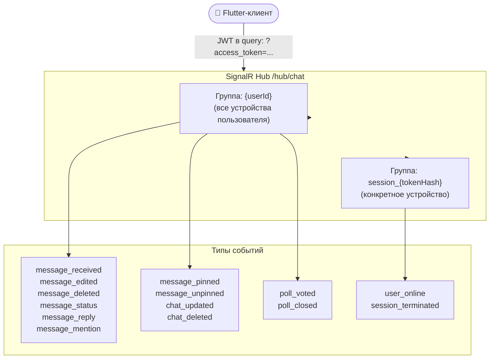
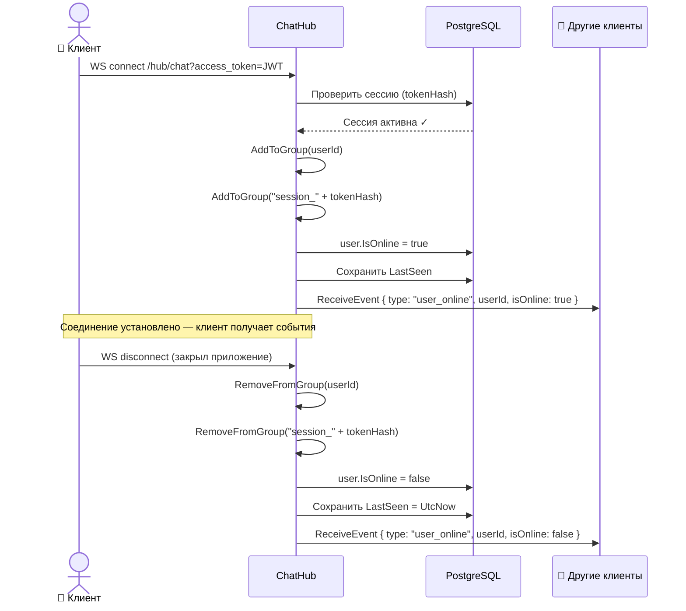
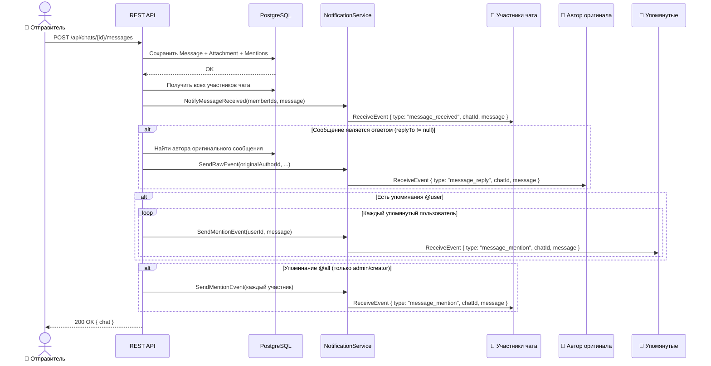
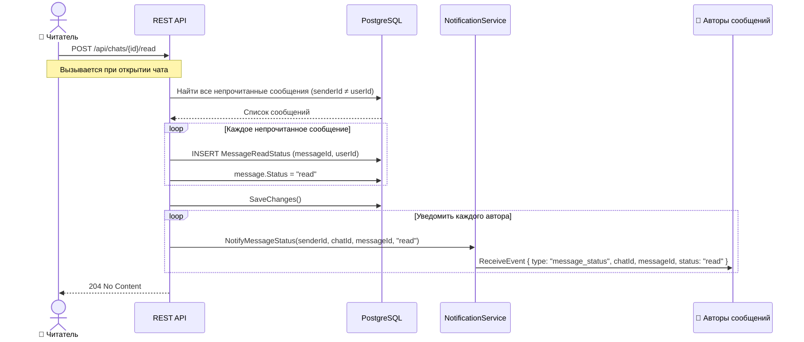
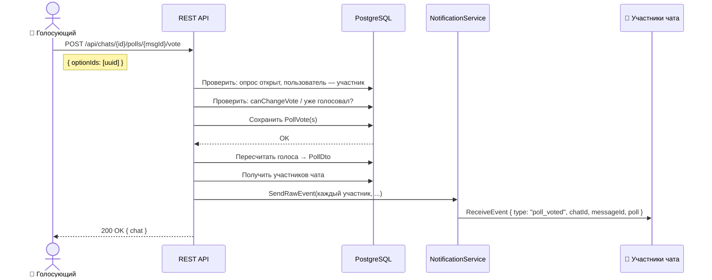
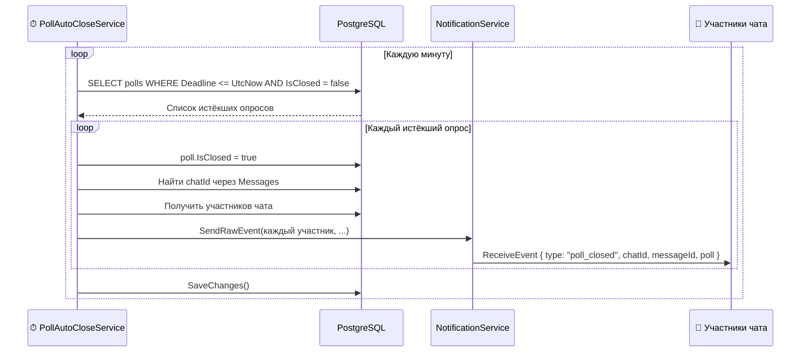
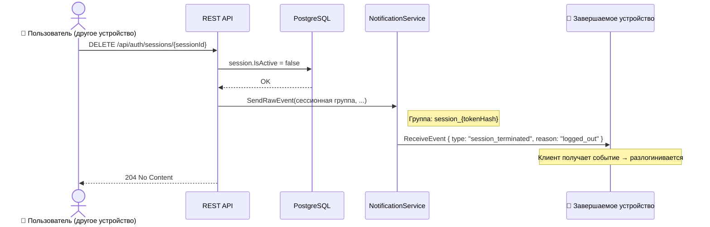
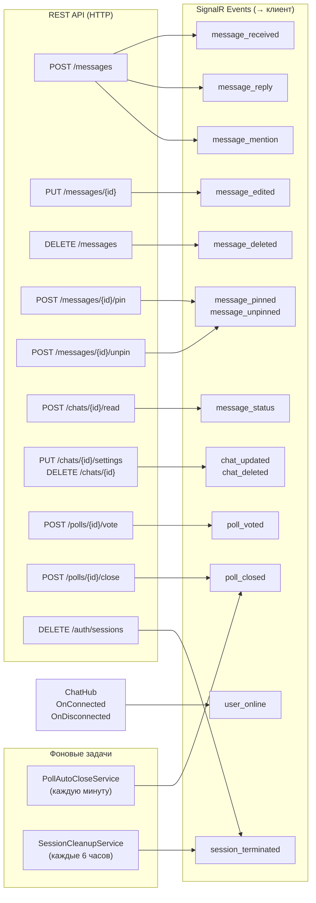

# Схема работы SignalR — Caspian College Messenger

---

## 1. Архитектура групп (Hubs & Groups)

> **Группа `{userId}`** — получает все события, связанные с контентом (сообщения, чаты, опросы).  
> **Группа `session_{tokenHash}`** — получает только системные события для конкретного устройства (принудительный выход).

---

## 2. Жизненный цикл подключения

---

## 3. Отправка сообщения

---

## 4. Прочтение сообщений

---

## 5. Голосование в опросе

---

## 6. Автоматическое закрытие опроса (фоновая задача)

---

## 7. Принудительное завершение сессии

---

## 8. Полная карта событий

---

## Итоговая таблица событий

| Событие | Получатель | Источник |
|---------|-----------|---------|
| `message_received` | Все участники чата | POST /messages |
| `message_edited` | Все участники чата | PUT /messages/{id} |
| `message_deleted` | Все участники чата | DELETE /messages |
| `message_reply` | Автор оригинального сообщения | POST /messages (если replyTo) |
| `message_mention` | Упомянутые пользователи | POST /messages (если mentions) |
| `message_pinned` | Все участники чата | POST /messages/{id}/pin |
| `message_unpinned` | Все участники чата | POST /messages/{id}/unpin |
| `message_status` | Автор сообщения | POST /chats/{id}/read |
| `chat_updated` | Все участники чата | PUT /chats/{id}/settings |
| `chat_deleted` | Все участники чата | DELETE /chats/{id} |
| `poll_voted` | Все участники чата | POST /polls/{id}/vote |
| `poll_closed` | Все участники чата | POST /polls/{id}/close, PollAutoCloseService |
| `user_online` | Все участники общих чатов | ChatHub.OnConnected/OnDisconnected |
| `session_terminated` | Конкретное устройство | DELETE /auth/sessions, SessionCleanupService |
